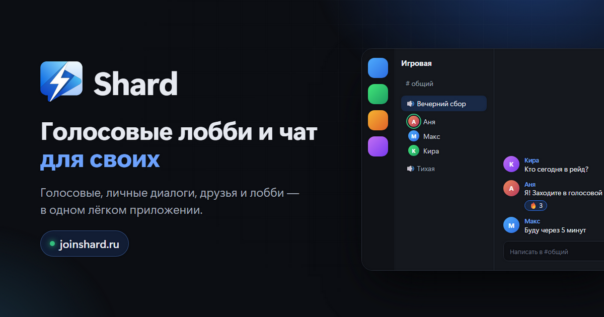
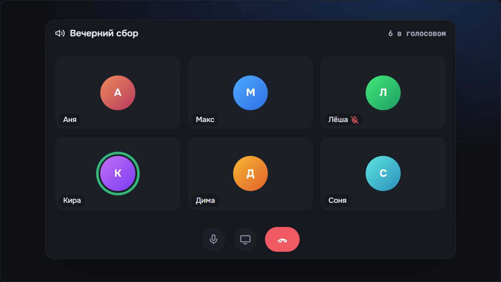
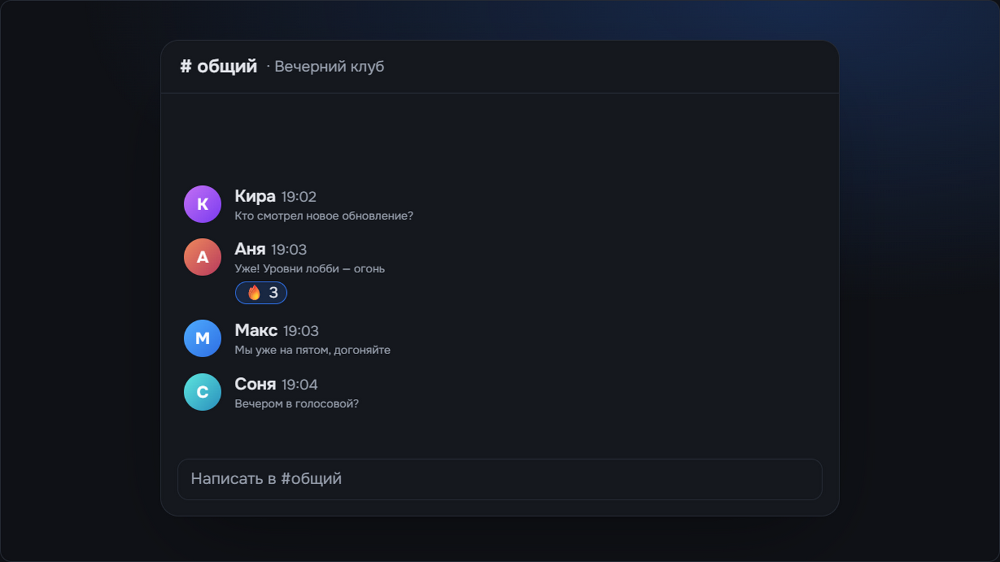
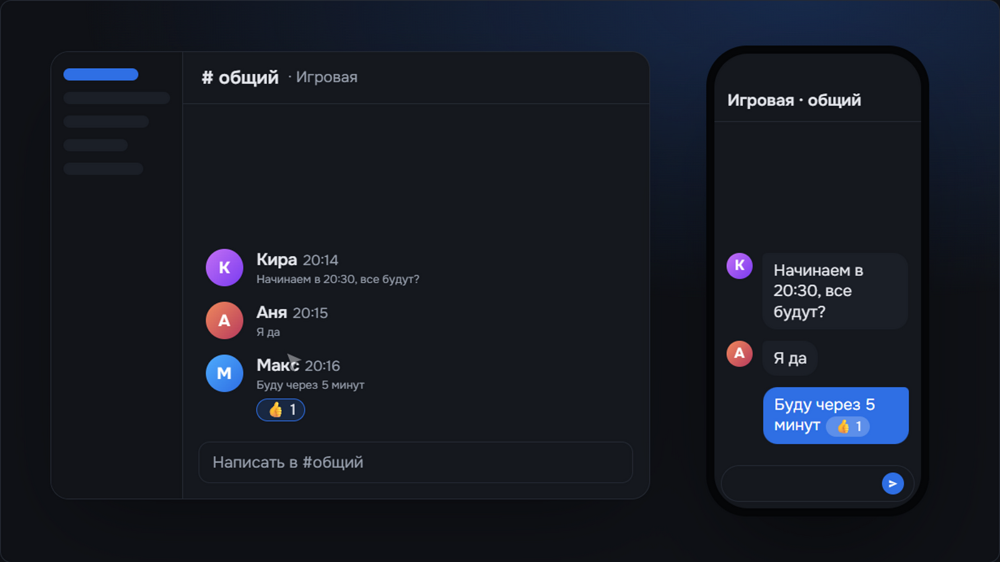
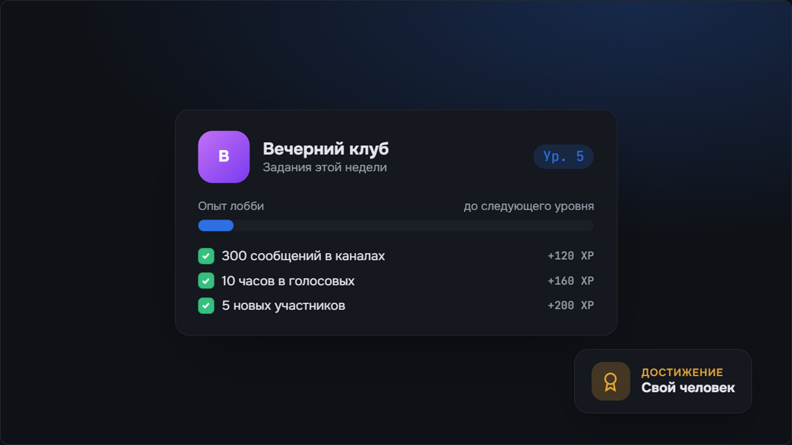
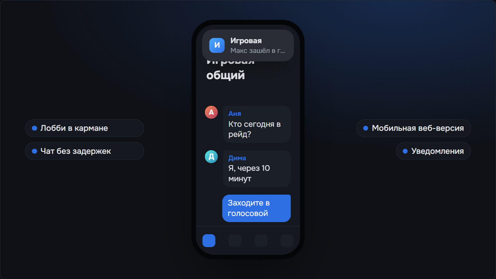

  

<h1 align="center">Shard</h1>

  Голосовые лобби и чат для своих
   
  <a href="https://joinshard.ru"><b>joinshard.ru</b></a>
  ·
  <a href="https://voice.joinshard.ru">Открыть в браузере</a>
  ·
  <a href="../../issues/new/choose">Сообщить об ошибке</a>

  <b>Русский</b> · <a href="README.en.md">English</a>

  

> [!WARNING]
> **Shard сейчас в альфа-версии.** Приложение активно разрабатывается: что-то может работать не так, как задумано, меняться от версии к версии или временно ломаться. Если наткнулись на ошибку — [расскажите нам](../../issues/new/choose), это очень помогает.

## Что такое Shard

Shard — место, где собираются ваши люди: друзья, игровая команда, сообщество. Заходите в голосовое лобби, переписывайтесь в каналах и личных сообщениях, звоните и показывайте экран — всё в одном лёгком приложении.

Мы делаем Shard, потому что хотим простой и быстрый способ быть на связи со своими — без лишнего шума.

## Кто мы

Shard делает **команда из трёх разработчиков**. Мы сами пишем приложение, сервер и сайт, сами выпускаем обновления и читаем каждый отзыв.

## Что уже есть

- **Лобби** — своё пространство для компании: текстовые и голосовые каналы, роли, приглашения.
- **Голосовые каналы** — заходите и говорите, с шумоподавлением и режимом «Нажми и говори».
- **Демонстрация экрана** — покажите игру или рабочий стол прямо в голосовом.
- **Личные сообщения и звонки** — переписка один на один и звонки друзьям.
- **Друзья** — добавляйте людей и смотрите, кто сейчас в сети.
- **Лента статей** — новости лобби и обновления Shard.
- **Уровни и достижения** — у вас и у вашего лобби, с заданиями, которые выполняют вместе.
- **Маркет** — оформление профиля за Shards.
- **Защита аккаунта** — двухфакторный вход через приложение-аутентификатор или почту.

## Как это выглядит

<table>
  <tr>
    <td width="50%"> Голосовой канал</td>
    <td width="50%"> Чат лобби</td>
  </tr>
  <tr>
    <td width="50%"> На компьютере и в телефоне</td>
    <td width="50%"> Уровень лобби и задания</td>
  </tr>
  <tr>
    <td colspan="2"> Мобильная веб-версия</td>
  </tr>
</table>

Изображения — иллюстрации интерфейса, имена выдуманы.

## Где пользоваться

| | |
|---|---|
| **Windows** | приложение — скачать на [joinshard.ru](https://joinshard.ru) |
| **Браузер** | [voice.joinshard.ru](https://voice.joinshard.ru) — без установки |
| **Телефон** | мобильная веб-версия по той же ссылке |

Shard бесплатный.

## Нашли ошибку или есть идея?

Нам важен каждый отзыв — особенно сейчас, в альфе.

- **Ошибка** — [создайте issue «Ошибка»](../../issues/new?template=bug_report.yml): что делали, что ожидали и что произошло. Скриншот очень помогает.
- **Идея** — [создайте issue «Идея»](../../issues/new?template=feature_request.yml).
- В самом приложении тоже есть кнопка **«Сообщить об ошибке»**.

Пожалуйста, не публикуйте в issues пароли, коды подтверждения и другие личные данные.

## Этот репозиторий

Здесь только описание Shard и место для отзывов — исходного кода тут нет.
